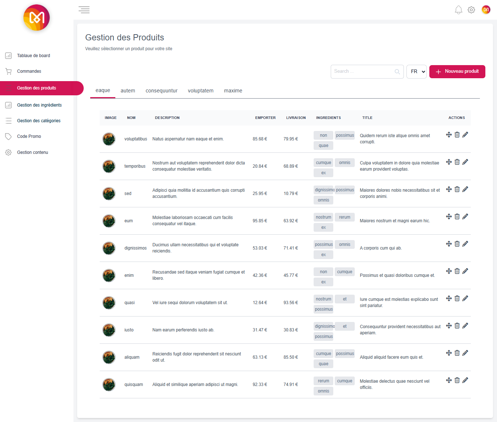

# 🛒 Product Management System — Laravel Blade

A clean and responsive **Product Management Web App** built entirely with **Laravel** and **Blade templates**, designed for **Admin-only access**. It allows managing products, categories, and stock efficiently.

---

## 📸 Screenshots

### 📦 Log in 

### 📦 Product List  

### ➕ Add Product Form  

### 🖥️ DELETE alert  

### 🖥️ PROMO 

### 🖥️ Update PROMO 

---

<h2>🔧 Features</h2>

<ul>
  <li> Admin Authentication (Login & Logout)</li>
  <li> Product CRUD (Create, Read, Update, Delete)</li>
  <li> Category Management</li>
  <li> code promo Management</li>
  <li> Product Image Upload</li>
  <li> Search & Filter Products</li>
  <li> Responsive Design (TailwindCss)</li>
</ul>

---

## 🛠️ Tech Stack

| Core            | Supporting        |
|-----------------|-------------------|
| Laravel 10      | Laravel Migrations |
| Blade Templates | Eloquent ORM       |
| TailwindCss     | MySQL              |
| Laravel UI/Auth | Laravel Seeder     |

---

